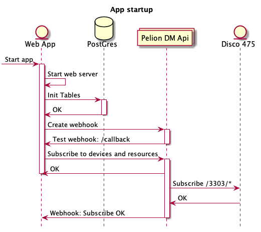

## App Architecture

This app consists of:

- barebones express.js web server
- react.js app
- postgres database

## App startup

At startup the app will initialise the db table and setup a [callback channel (webhook)](https://www.pelion.com/docs/device-management/current/integrate-web-app/event-notification.html) with Pelion Device management. The app will then send a request to initiate [subscriptions to device resources](https://www.pelion.com/docs/device-management/current/device-management/resource-change-webapp.html).

## Device resource changes

When the resource value on a device changes, the notification channel is updated with this information and the web app stores each notification in the postgres database.

## Visualising Data

The included react app requests all data from the server and visualises this using the [Recharts](http://recharts.org/en-US/) library.

