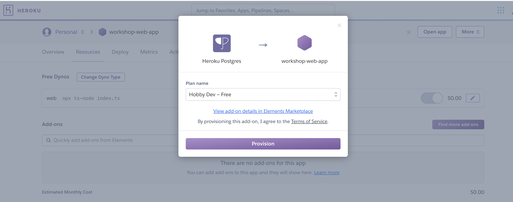
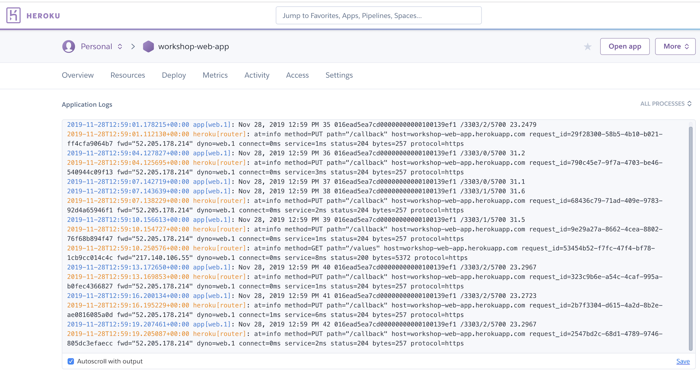

# Getting started with this application

## Required

You will need two pieces of information at a minimum to get this running correctly.

- `APIKEY` - API Key from Pelion Device Management - https://portal.mbedcloud.com/
- `APP_HOST` - URL of the application to be deployed - `https://<APP>.herokuapp.com/`

## Deploy from Github

Create an app in Heroku by cloning from an existing Git repository

1. Goto Github app: [Workshop App on Github](https://github.com/ARMmbed/pelion-quick-start-web-app)
2. Click Deploy to Heroku button
3. Create a free Heroku account
   - Provide First name, Last name, Email address, Role, Country, Development language
4. Confirm your email and set a password
5. Welcome -> Click here to proceed
   - Continues create app flow
   - Enter name for your app: `APP`

Build process starts and app will deploy to `https://<APP>.herokuapp.com/`

## Set Config Vars

Heroku apps provide configuration options through environment variables. These are called config vars. Two are required for this app to be setup correctly. There are three more that are optional.

- Start at `https://dashboard.heroku.com/apps/<APP>`
- `Manage App` --> `Settings` --> `Reveal Config Vars`

| Key                  | Value                                  | Optional | Default                             |
| -------------------- | -------------------------------------- | -------- | ----------------------------------- |
| API_KEY              | `APIKEY`                               |          |                                     |
| APP_HOST             | https://`APP`.herokuapp.com/           |          |                                     |
| API_HOST             | `APIHOST`                              | ✓        | https://api.us-east-1.mbedcloud.com |
| LONG_POLLING_ENABLED | `true` or `false`                      | ✓        | `false`                             |
| DEVICE_ID            | Comma separated list of device IDs     | ✓        | \*                                  |
| RESOURCE             | Comma separated list of resource paths | ✓        | /3303/\*                            |

## Provision a Database

This app requires access to a Postgres database to store resource values. Heroku provides a free-tier access to hosted Postgres without requiring billing information

1. Start at `https://dashboard.heroku.com/apps/<APP>`
1. Navigate to `Resources` -> `Add-ons`
1. Search for `postgres` and attach a free "Hobby Dev" account

## Check for issues

The Heroku app deploys into `dynos` which are hosted containers running application code. The website provides access to the logs and output of the application

- Start at `https://dashboard.heroku.com/apps/<APP>`
- `More` button --> `View logs`
- Logs should show no errors

## Check deployment

The app is also available at the website provided. Once the application is confirmed to be running in the logs and the config vars are set, it is time to view the app

- Click `Open App`

